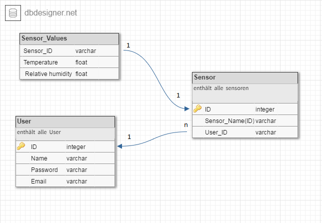

# 1 Zielbestimmung(Richard)
Die Bereitstellung eines Dockerimages mit einen Webserver + Datenbank, so konfiguriert, dass leicht neue Temperatursensoren in die Weboberfläche integriert werden können und die Daten dazu angezeigt werden.

## Musskriterien
Es soll ein funktionfähiges Skript für den Microcontroller zur Verfügung gestellt werden, sodass dieser Daten vom Temperatursensor erhält und an einen Server schickt.

Der Sever, der die ermittelten Daten erhält, speichert diese in einer Datenbank.

Die Messdaten soll man in der Weboberfläche anschaulich einsehen können.

## Kannkriterien
Für die komplette Infrastruktur soll ein Icinga2- bzw. Nagios-Plugin zur Verfügung gestellt werden, welches die Sensoren respektive die Werte der Datenbank in die entsprechende Monitoringsoftware integriert und so auch für Computerlandschaften interessant macht, die bereits mit Nagiosderivaten arbeiten.

## Abgrenzungskriterien
Abgrenzungskriterien: Diese Kriterien sollen bewusst nicht erreicht werden.

# 2 Einsatz (Martin)

Das Einbinden und der Abruf von Sensordaten soll duch eine Weboberfläche möglich sein.
 
## Anwendungsbereiche
Die Anwendung kann überall eingesetzt werden, wo Strom und ein Wlan-Netz zur Verfügung steht, d.h. es kann für die Messung von Temperaturdaten im Wohnbereich, in Serverräumen und in öffentlichen Gebäuden etc. eingesetzt werden. 
 
## Zielgruppen
Informatiker (und Informatikaffine Nutzer) die den ESP8266 zur Messung und Anzeige von Temperaturdaten nutzen wollen. Die größte Hürde stellt dabei die Programmierung des Microcontrollers dar. Ist der Microcontroller erst einmal korrekt in das System eingebunden, sollen auch Laien dazu in der Lage sein, sich den Temperaturverlauf in einer Weboberfläche anzeigen zu lassen. 
 
## Betriebsbedingungen
- Betriebsbedingungen: der Einsatz der Technik sollte drinnen geschehen und aus Sicherheitsaspekten lediglich im Intranet betrieben werden
- Betriebszeit: dauerhafter Betrieb 24 Stunden 7 Tage in der Woche
- Beobachtung: unbesichtigter Betrieb
 
# 3 System Vorraussetzungen
## 3.1 Hardware
### 3.1.1 Sensor und Microcontroller
Um die Werte der Temperatur und der Luftfeuchtigkeit zu ermitteln, wird der Sensor DHT22 benutzt. Dieser wird mit dem Microcontroller "ESP8266 NodeMCU" verbunden. 

<figure>
	
	<figcaption>DHT22</figcaption>
</figure>

<figure>
	
	<figcaption>ESP8266</figcaption>
</figure>

<!---->
<!---->

Technische Daten des DHT22:
- Digital Temperatur und Luftfeuchtigkeit ermitteln
- Chip Typ DHT22
- Betriebsspannung: DC 3.3-5.5V
- Luftfeuchtigkeitsmessbereich : 0 bis 100% relative Luftfeuchte
- Feuchtemessgenauigkeit: ±2% RH
- Temperaturbereich: -40 bis +80 C
- Temperaturmessgenauigkeit ±0.5
- Single-Bus – Digitalsignalausgang, bidirektionale serielle Daten
- zahlreiche Beispielprogramme für gängige Board im Internet verfügbar
- Maße: 28mm x 12mm x 10mm

Das ESP8266 von dem Hersteller Espressif ist ein programmierbarer WLAN-SoC mit UART- und SPI-Schnittstelle.

Technische Daten des ESP8266
- 802.11 b/g/n
- Wi-Fi Direct (P2P), soft-AP
- Integrated TCP/IP protocol stack
- Integrated TR switch, balun, LNA, power amplifier and matching network
- Integrated PLLs, regulators, DCXO and power management units
- +19.5dBm output power in 802.11b mode
- Power down leakage current of <10uA
- Integrated low power 32-bit CPU could be used as application processor
- SDIO 1.1/2.0, SPI, UART
- STBC, 1×1 MIMO, 2×1 MIMO
- A-MPDU & A-MSDU aggregation & 0.4ms guard interval
- Wake up and transmit packets in < 2ms
- Standby power consumption of < 1.0mW (DTIM3)
- VCC: 3,3V (Achtung: Eingänge sind NICHT 5V TOLERANT!)

### 3.1.3 Server Hardware
- Prozessor Architektur x86
- beachte Anforderungen für Betriebssysteme

### 3.1.4 Client Hardware
- Betriebssystem: Windows, Mac OS X, Linux 32bit/64bit

## 3.2 Software
### 3.2.1 Server Software
Betriebssystem: 
- CentOS 7.1/7.2 & RHEL 7.0/7.1/7.2 (YUM-based systems)
- Ubuntu 14.04 LTS
- SUSE Linux Enterprise 12

- Docker Version 1.12.2

### 3.2.2 Client Software

- Arduino IDE Version 1.6.12
- Webbrowser neueste stabile Version(Firefox, Chrome,Opera,...)
 
## Orgware
Orgware: Angabe der organisatorische Rahmenbedingungen, die vor Projektstart
erfüllt sein müssen.
 
# 4 Funktionalität (Jörg)

## 4.1 Installation: Organisation der Programmbestandteile in Docker-Images.

Die Bestandteile des Programmes befinden sich in Docker-Images, die auf dem eingesetzten Server in Docker-Containern ausgerollt werden. Der Nutzer benötigt dafür lediglich Kenntnisse über das Instanziieren von Docker-Containern. Diese können über das Internet leicht beschafft werden und sind überdies im Github-Repository dieses Projektes erklärt. Alles, was der Anwender an Dateien braucht, ist eine "Docker-Compose"-Datei, die er vom Github-Repository herunterladen und dann nach der Installation der Programme "Docker" und "Docker-Compose" einfach per Kommandozeile ausführen kann. Das Weitere geschieht automatisch: Die Docker-Images werden heruntergeladen, in die Dockerüblichen Verzeichnisse kopiert und orchestriert gestartet, so, dass die Anwendung ohne weiteres Zutun und in Gestalt des Webfrontends unter einem festgelegten Socket (Default ist localhost:80) bereit steht.

## 4.2 Einbinden neuer Sensoren

Um neue Sensoren in die Infrasturktur zu integrieren, sind einige Vorbereitungen nötig. Es wird benötigt:
- Sensor DHT22
- Wlan-chip esp8266 development board
- Software Arduino

Als erstes wird ein neuer Sensor in der Weboberfläche erstellt. Dazu logt man sich in der Weboberfläche ein und geht zu der Übersicht aller Sensoren. Dort erstellt man einen neuen Sensor. Nachdem man einen Namen und einen Ort vergeben hat, sieht man in der Tabelle einen neuen Eintrag mit dem erstellten Sensor. In der ersten Spalte steht die Id die ihm zugewiesen wurde, diesen merkt man sich.

Der Wlan-chip wird über die Software Arduino programmiert. In dem Verzeichnis esp8266 findet man den benötigten Code. Am Anfang müssen

`const char* ssid = "************";`  
`const char* password = "**********";`

konfiguriert sein, damit sich der Wlan-Chip mit das vorhandene W-Lan Netzwerk verbinden kann. In der Zeile

`client.println("GET /info.php?chipid=ID&temperature=" + tstring + "&humidity=" + hstring);`

muss noch "ID" mit der gemerkten ID des Sensors ersetzt werden. Nachdem der Sensor richtig mit dem Wlan-Chip verbunden wurde, kann der Wlan-Chip über ein micro USB Kabel mit Strom versorgt werden.

Bild
abweichungen möglich

## 4.3 Administration im Webfrontend

Die Webseite bietet eine Nutzerverwaltung (Nutzer hinzufügen, entfernen, verändern und mit Passwörtern versehen) und die Möglichkeit, Sensoren hinzuzufügen, zu entfernen und deren Metadaten zu verändern. Bei all diesen Tätigkeiten kommuniziert die Webapp mit einer MariaDB im Hintergrund, die sich in einem separaten Dockercontainer befindet.

##

Funktionalität: Spezifikation der einzelnen Produktfunktionen mit genauer und
detaillierter Beschreibung.
 
* Typische Arbeitsabläufe
* Keine Angabe von typischen Verwaltungsfunktionen (Create, Read, Update, Delete)

 
# 5 Daten (Martin)

Nutzerdaten, Daten zum Sensor sowie die gesammelten Sensordaten werde in einer Datenbank gespeichert. 

# 6 Leistungen
Leistungen: Anforderungen bezüglich Zeit und Genauigkeit
 
# 7 Aufbau des Webfrontends (Leo)

Für den grundlegenden Aufbau des Webfrontends wurde sich am MVC (Model View Controller) Muster orientiert. 

Hierbei kann man auch sagen, dass es bereits viele vorgefertigte Lösungen gibt, welche man einfach verwenden kann, jedoch sind diese meistens zu komplex bzw. schwierig zu verstehen und zu erweitern. Desweiteren ist man mit diesen Lösungen zu eingeschränkt und kann nicht genau nach seinen eigenen Vorstellungen arbeiten. Aus diesen Gründen wurde ein eigenes „Framework“ erstellt, welches sich am MVC orientiert. 

## 7.1 Eigenes Framework

In der Praxis bedeutet dies, dass das Arbeiten möglichst vereinfacht werden soll durch eine gewisse Grundstruktur, die zwar schwierig ist zu erstellen bzw. Zeit benötigt, die dann aber alle nötigen Grundfunktionen bietet, um die Webseite schnell zu erweitern. Alle Anfragen, die an den Webserver kommen, werden auf die index.php umgeleitet, welche die Anfrage auswertet. Über das Format localhost/Controller/Action werden so die einzelnen Funktionen aufgerufen. Um auf die Startseite zu gelangen ist dies zum Beispiel localhost/index/index. (Aufruf bedeutet IndexController und indexAction). 
Model beinhaltet:
- Datenbankverbindungen und Funktionen (PDO zur Realisierung von OOP)
Um dann die Daten darstellen zu können, muss sich hinter dem Controller im Ordner „views“ eine gleichnamige .phtml-Datei befinden, die dem Namen der Action entspricht also im Fall der indexAction die /views/index.phtml

## 7.2 Funktionen der Webseite

### 7.2.1 Workflow

### 7.2.2 Login

- Login Funktionalität mit Datenbanküberprüfung der eingegeben Daten
- Auswahl der Sprache (Mehrsprachigkeit)
- Link zum Registrieren

### 7.2.3 Registrieren

- Neuanlegen eines Benutzeraccounts mit verschiedenen Feldern
- RegEx Überprüfung hinter jedem Feld mit Erläuterung im Infofeld jeder Zeile (Frontend und Backend)
- Überprüfung, dass Benutzername nur einmalig ist (Frontend und Backend)

### 7.2.4 Loginseite
- geschützt durch Login, ohne diesen nicht erreichbar
- Menü, um verschiedene Funktionalitäten aufzurufen

Homebildschirm
- kleine Begrüßung, Übersicht
- Funktionalität bzw. Bild fehlt noch
Tabelle der Sensoren
- Übersicht über alle Sensoren mit zugehörigem Benutzer und zusätzlichen Infos
- Möglichkeit einen neuen Sensor zu erstellen
- Aktualisierung, Suche, Sortierung, Exportieren der Daten
- Kontextmenü über Rechtsklick auf Datensatz:
Informationen: Diagramm mit eingetragenen Daten und die dazu gehörige API
Bearbeiten: Bearbeiten des Sensors z.B. Ort ändern
Löschen: Sensor und dazu gehörige Daten löschen

Benutzereinstellungen
- Funktionalitäten bezüglich des Benutzers z.B. Passwortänderung
- Funktionalität bzw. Bild fehlt noch
Logout
- Ausloggen mit Redirect auf Startseite

## 7.3 API

- API (Programmierschnittstelle) zum Speichern der Sensordaten in der Datenbank. Aufruf der entsprechenden ControllerAction mit den entsprechenden Parametern (ID des Sensors, Temperatur und Luftfeuchtigkeit)
- speichert die Daten in der sensor_datas (beinhaltet Sensordaten von allen Sensoren) mit Zeitstempel

## 7.4 Design der Webseite

Für die Gestaltung der Webseite wurde das öffentlich zugängliche Bootstrap verwendet, welches von Twitter entwickelt wurde. Es ist vor allem darauf konzipiert, Webseiten einfach zu gestalten und ebenfalls optimiert für die Anwendung auf mobilen Endgeräten wie Tablets oder Smartphones. Im allgemeinen wird es als CSS-Framework beschrieben und bietet Gestaltungsvorlagen für verschiedenste Elemente einer Webseite und lässt diese durch wenige Handgriffe bzw. Anpassungen ansehnlich aussehen. Es gibt für Bootstrap mehrere Erweiterungen, so genannte Plugins, die JS beinhalten und speziellere Funktionen bieten, wie die Erstellung von Tabellen, welche dann einige Grundfunktionen bieten, wie interaktive Aktualisierung, Sortierung bzw. Suche, als auch den Export von Daten. Dieses Plugin wurde ebenfalls verwendet für dieses Projekt innerhalb des Frameworks.

 
# 8 Qualitätsziele (Martin)

- Zuverlässigkeit: das Sytem soll in der Lage sein Temperaturen innerhalb des Toleranzbereiches des eingesetzten Sensores (DHT22) von +- 0.5 °C anzuzeigen und zu speichern
- Benutzerfreundlichkeit: 
- Modularität: modularer Aufbau durch den Einsatz Docker, so dass die MariaDB Datenbank durch eine MySQL Datenbank mit geringfügigen Änderungen ausgetauscht werden kann. 
- Preis/Leisung: Einsatz von Standardkomponenten mit geringen Energieverbrauch und geringen Kosten
- Portierbarkeit: durch den Einsatz von Standardbibliotheken soll Andwendung portierbar gehalten werden
- Robustheit: das System soll innerhalb von Gebäuden ohne Störung konstant funktionieren

# 9 Integration in die Monitoringsoftware "Icinga2" (Jörg)

Ein mögliches Anwendungsgebiet des Temperatursensors ist die Überwachung bspw. der Kühlung von Serverräumen. Dafür ist es sinnvoll, ihn in bestehende Monitoringsoftwarelösungen zu integrieren. Zu diesem Zweck wird ein Plugin für Icinga2, einer Weiterentwicklung von Nagios, entwickelt. Mithilfe des Addons Graphite werden die Daten innerhalb von Icinga2 visualisiert. Die Daten werden der bestehenden Datenbank entnommen.

## 9.1 Realisierung mit Bash-Script

Das Icinga2-Plugin wird mithilfe eines Bashscriptes realisiert, das vom Icinga2-Server in wohldefinierten Intervallen aufgerufen wird und mit einem von folgenden Exitcodes schließt:

Neben dem Exit-Code wird der Temperaturwert an Icinga2 übermittelt. Wenn die Temperatur über einen bestimmten Schwellwert steigt, wird ein „Warning“ bzw. ein „Critical“ ausgegeben. Dabei können die einzelnen Werte diskuttiert und angepasst werden.

## 9.2 Einfache Installation und Erweiterbarkeit

Die Integration eines neuen Temperatursensors in Icinga2 soll so einfach wie möglich sein. Pro Sensor soll es nur ein einzelnes Script geben. D.h. wird ein weiterer Raum und/oder Sensor in die Überwachung aufgenommen, muss ein weitgehend geklontes Script in Icinga2 integriert werden. Dazu werden die Scripte der Übersichtlichkeit halber in ein seperates Verzeichnis kopiert. Es wird vermieden, lange Scripte vorhalten zu müssen, deren Konfiguration und Erweiterung unübersichtlich ist. Es gilt der Grundsatz „One Service – One File“.

## 9.3 Visualisierung mit Graphite

Für die graphische Aufbereitung wird die Software „Graphite“ eingesetzt. Sie speichert die ermittelten Daten in einer weiteren Datenbank und gewährt so Einblicke in den zeitlichen Verlauf der Temperaturen in den Serverräumen. Graphite ist eine eigenständige Software, die dank vordefinierter Schnittstellen als Plugin in Icinga2 integriert werden kann. Zu beachten ist, dass die Maschine, auf der der Icinga2-Server mit Graphite läuft, mindestens 1 GB RAM vorweist. Graphite benötigt viel Hauptspeicher um seine Grafiken anzuzeigen. 

# 10 Ergänzungen 
Hier ist Platz für nicht im Pflichtenheft abgedeckte Themengebiete oder ein
Glossar.
